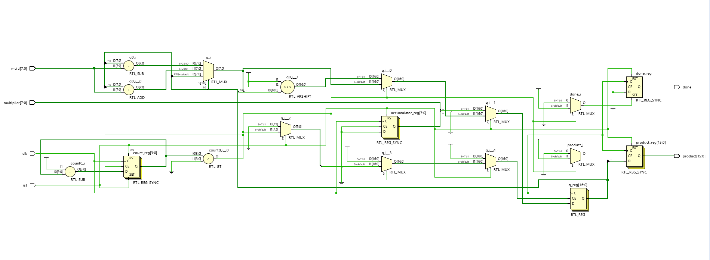

# Radix-2 Booth Multiplier

This project implements a **Radix-2 Booth Multiplier** using Verilog HDL, designed and tested on the Basys 3 FPGA platform. The design uses **behavioral modeling**, leveraging Verilog's `$signed` operations for correct signed multiplication.

---

## Key Features

- **Multiplication Type:** Signed multiplication using **Radix-2 Booth Algorithm**
- **Input Width:** Configurable bit-widths for multiplicand and multiplier
- **Verilog Constructs:** Behavioral code with use of `$signed` for signed number handling
- **Hardware Platform:** Simulated and synthesized for **Basys 3 FPGA**

---

## Schematic

---

## How It Works

---

---

## How It Works

This Booth multiplier was built for **8-bit signed data**, using **behavioral Verilog** constructs with `$signed` operations.

### Booth Encoding
- Booth’s algorithm reduces the number of arithmetic operations by encoding the multiplier bits.
- Instead of examining one bit at a time, Booth’s method evaluates **two bits** (current and previous) to determine whether to **add**, **subtract**, or **do nothing** with the multiplicand.
- It is efficient for handling **signed multiplication**, especially when operands contain consecutive 1s.

### 17-Bit Booth Register
A key element of this design is the **17-bit register**, which combines:
- **8-bit Accumulator (A)**
- **8-bit Multiplier (Q)**
- **1-bit Q-1** (holds the previous LSB of the multiplier)

#### Operation Cycle
1. At the start of each cycle, the **lowest two bits** (`Q[0]` and `Q-1`) are used to determine the operation based on Booth encoding:
   - `00` → No operation
   - `01` → Add multiplicand to accumulator
   - `10` → Subtract multiplicand from accumulator
   - `11` → No operation

2. After the operation, the entire 17-bit register is **arithmetically right-shifted by one**.
   - This shifts in the sign bit for `A` (to maintain sign extension),
   - Shifts bits of `Q` to the right,
   - Updates `Q-1` with the old `Q[0]`.

3. This process is repeated **8 times** (for 8-bit input), and then the product is extracted from the concatenated value of `A` and `Q`.

---

## Output Waveform

---

## Output Verification

- The design was simulated using **Vivado**.
- Testbenches were written to cover both positive and negative inputs.
- The output products were verified against **truth tables** and expected binary multiplication results.
- Correct multiplication results were observed in waveform outputs.

